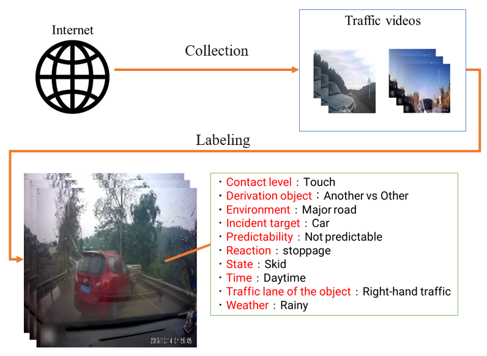

# V-TIDB (VARIOUS-PERSPECTIVE TRAFFIC INCIDENT DATABASE)

paper: Traffic Incident Database with Multiple Labels Including Various Perspective Environmental Information (IROS2023)  
Author: Shota Nishiyama, Takuma Saito, Ryo Nakamura, Hirokatsu Kataoka, Kensho Hara  
Affiliation, Organization:  
Aichi Institute of Technology Graduate School of Business Administration and Computer Science (AIT),   
Tokyo Denki University,   
National Institute of Advanced Industrial Science and Technology (AIST),   
Fukuoka University,   
Keio University  

## Overview

  
V-TIDB is a dataset with 10 different labels with various perspectives, 
and the effectiveness of the various perspective environmental information was demonstrated in an experiment using 3D ResNet.

## Abstract

Abstract— Traffic accident recognition is essential in develop-
ing automated driving and Advanced Driving Assistant System
technologies. A large dataset of annotated traffic accidents is
necessary to improve the accuracy of traffic accident recogni-
tion using deep learning models. Conventional traffic accident
datasets provide annotations on the presence or absence of
traffic accidents and other teacher labels, improving traffic ac-
cident recognition performance. However, the labels annotated
in conventional datasets need to be more comprehensive to de-
scribe traffic accidents in detail. Therefore, we propose V-TIDB,
a large-scale traffic accident recognition dataset annotated
with various environmental information as multi-labels. Our
proposed dataset aims to improve the performance of traffic
accident recognition by annotating ten types of environmental
information as teacher labels in addition to the presence or
absence of traffic accidents. V-TIDB is constructed by collecting
many videos from the Internet and annotating them with
appropriate environmental information. In our experiments,
we compare the performance of traffic accident recognition
when only labels related to the presence or absence of traffic
accidents are trained and when environmental information is
added as a multi-label. In the second experiment, we compare
the performance of the training with only “contact level,”
which represents the severity of the traffic accident, and the
performance with environmental information added as a multi-
label. The results showed that 6 out of 10 environmental
information labels improved the performance of recognizing the
presence or absence of traffic accidents. In the experiment on
the degree of recognition of traffic accidents, the performance
of recognition of car wrecks and contacts was improved for
all environmental information. These experiments show that V-
TIDB can be used to learn traffic accident recognition models
that take environmental information into account in detail and
can be used for appropriate traffic accident analysis.

## Type of Various Perspective Label 

- positive/negative (Traffic Incident)
- Category (Incident Targets)
- Contact_level (Contact Level)
- Derivation_object (Derivation Object)
- Environment (Environment)
- Predictablility (Predictability)
- Reaction (Reaction)
- State (State)
- Time (Time)
- Traffic_lane_of_the_object (Traffic Lane)
- Weather (Weather)

## Description of the V-TIDB annotations json

Our annotation file is [here](asset/nidb_data_4stage_v5.json).

- database
  - ID (format: {youtube_video_id}\_{start_time}\_{end_time})
    - annotations 
      - labels (various-perspective labels assigned to the video in question)
      - segment 
- label (Key-value pairs for parent and child categories)

## Citation

```
@InProceedings{VTIDB,
author = {Shota Nishiyama and Takuma Saito and Ryo Nakamura and Hirokatsu Kataoka and Kensho Hara},
title = {Traffic Incident Database with Multiple Labels Including Various Perspective Environmental Information},
booktitle = {Proc. IEEE/RSJ International Conference on Intelligent Robots and Systems (IROS)},
year = {2023},
}
```

